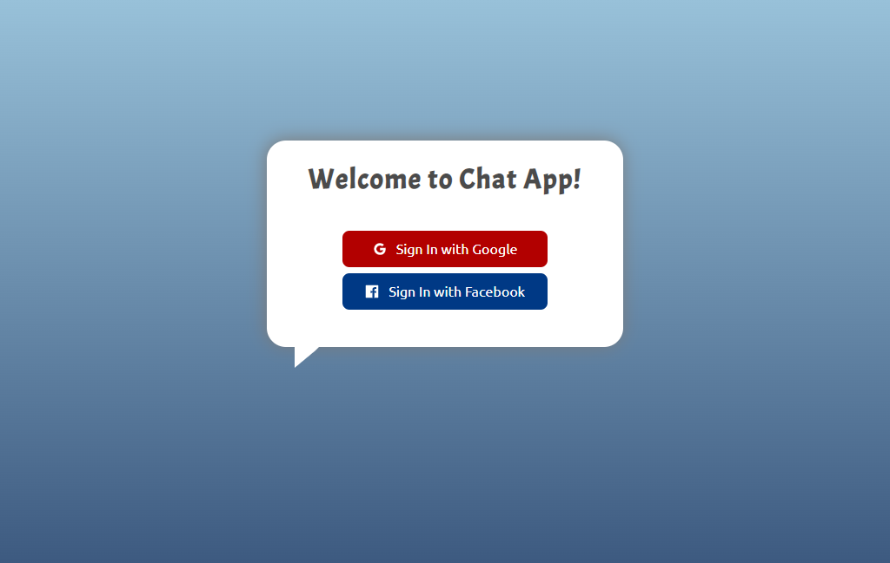

# Chat App

<!--  -->

A real-time Chat Application with Social authentication using Firebase and dedicated chat APIs/sockets.

 <table width="100%"> 
<tr>
<td width="50%">   
    

  Login

</td> 
<td width="50%">
 

  Chat

  
</td>
</table>

### Built With

<li>React JS</li>
<li>Firebase</li>
<li>Chat Engine</li>
